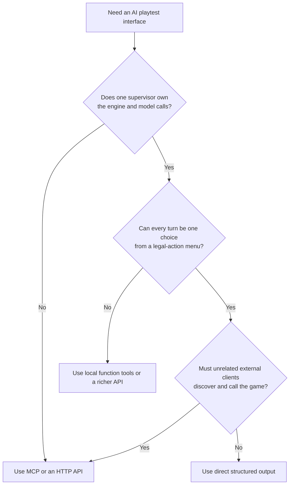
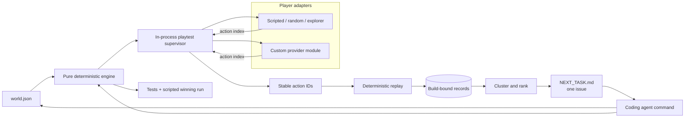
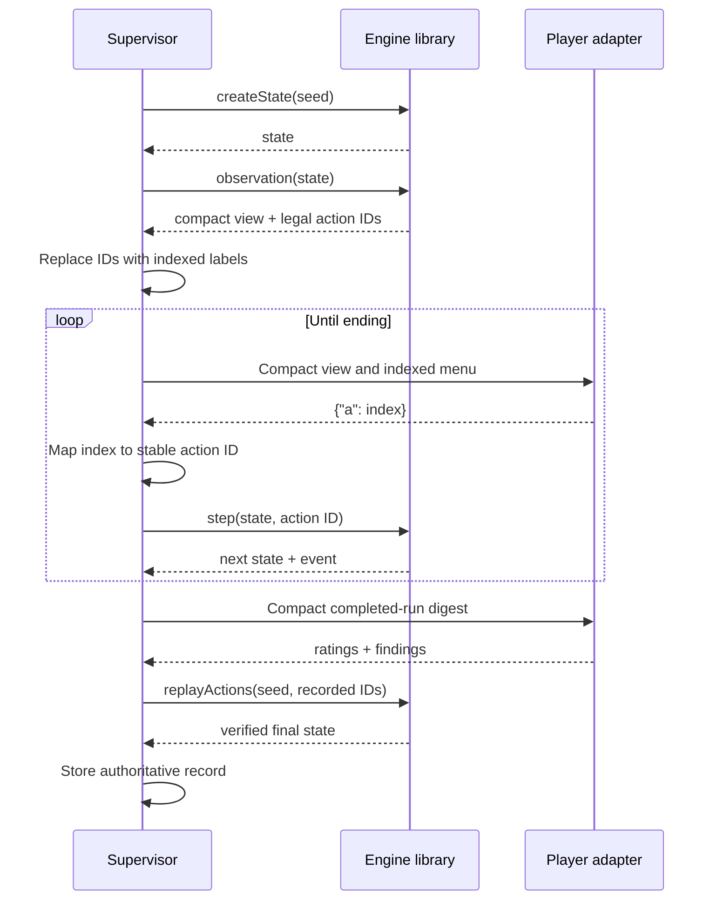
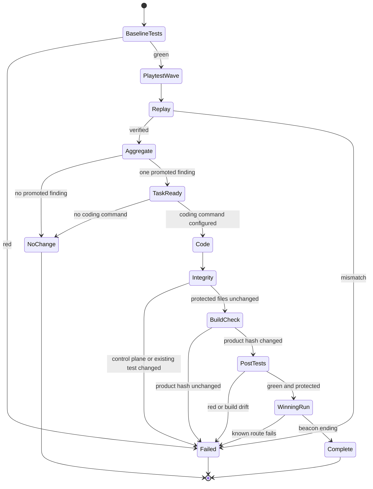
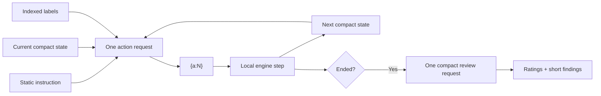
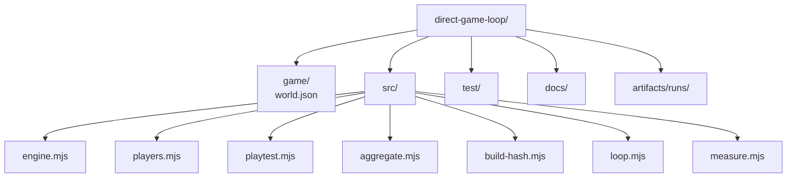

# Direct Game Loop architecture

## Decision

Use the direct supervisor only when all of these statements are true:

1. The automated runner owns the engine process.
2. The player only needs a closed set of game actions.
3. The runner owns state, outcomes, and trace recording.
4. No third-party client needs runtime discovery.
5. No remote game-service boundary is required.
6. Audited proof of an external client's complete tool surface is not a requirement.

These conditions hold for the autonomous playtest lane. They do not necessarily hold for manual play, public integrations, or remote products.



## Runtime architecture



## Player-turn sequence



The player never controls the state machine. It does not report the action trace or outcome. This is stronger and smaller than asking an MCP client to play and then trusting its final report.

## Coding cycle



## Token controls



Controls:

- No tool definitions.
- No tool-selection tokens.
- No JSON-RPC envelope.
- No model-visible session ID or revision.
- No raw state.
- No full transcript on each turn.
- One-field action output.
- Stateless action calls with durable facts supplied by the engine.
- One review call after the ending.
- Optional provider usage is stored when a custom module reports it.

## Data ownership

| Data | Authority |
| --- | --- |
| Legal actions | Engine |
| Current state | Supervisor and engine |
| Action trace | Supervisor |
| Outcome | Engine |
| Trace validity | Deterministic replay |
| Ratings and experience findings | Player model |
| Promotion and ranking | Deterministic aggregator |
| Code change | Coding agent |
| Acceptance | Tests, build hash, winning run |

## Repository structure



## Build order

1. Build a pure deterministic reducer.
2. Put content and rules in data.
3. Make legal actions an engine output.
4. Build one in-process session runner.
5. Define the player adapter interface.
6. Add deterministic CI players.
7. Add an optional provider module only when an external model is required.
8. Record the supervisor-owned action trace.
9. Replay before accepting a report.
10. Bind reports to the product build hash.
11. Aggregate into one task.
12. Add the coding-agent command and mechanical post-change gates.
13. Measure actual requests, tokens, and prompt bytes.
14. Add an external protocol only after an external-client requirement exists.

## When to add a protocol

Add MCP when an existing MCP host must play the game without importing this repo.

Add HTTP when playtest workers must run on other machines or in a hosted fleet.

Add a small child-process JSON protocol when the engine must be isolated from crashes or written in another language.

Do not add any of these only to make an in-process call look more architectural. The boundary must solve an actual ownership, deployment, or interoperability requirement.

## Scaling path

The direct interface stays stable as the system grows:

```text
player.choose(compact turn) -> action index
engine.step(state, action ID) -> next state
player.review(compact run) -> findings
```

A later distributed runner can move the supervisor behind HTTP without changing the engine. A later MCP adapter can translate `game_start` and `game_step` into the same engine calls. Neither protocol should become the engine's source of truth.
